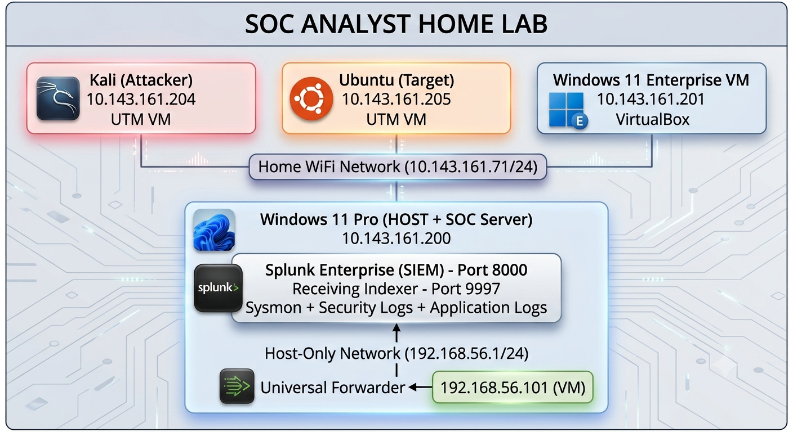
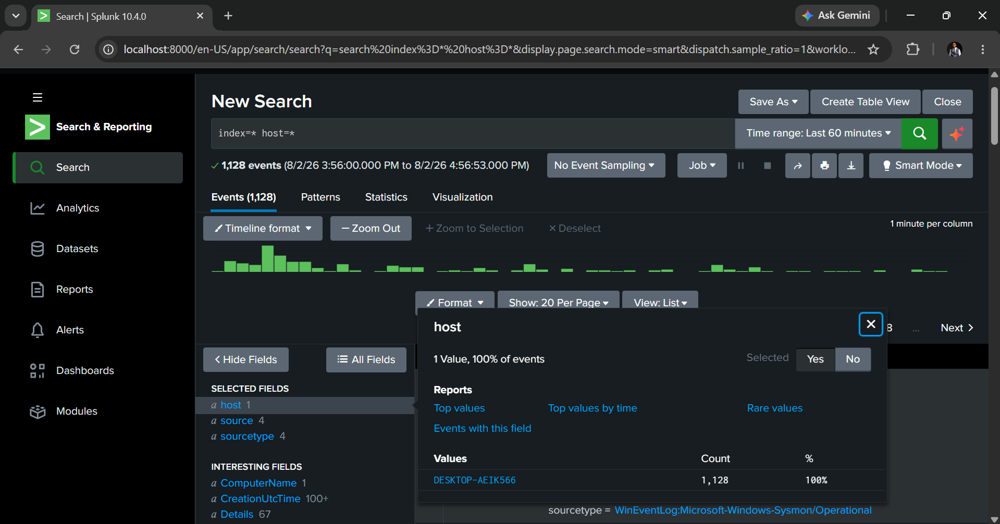
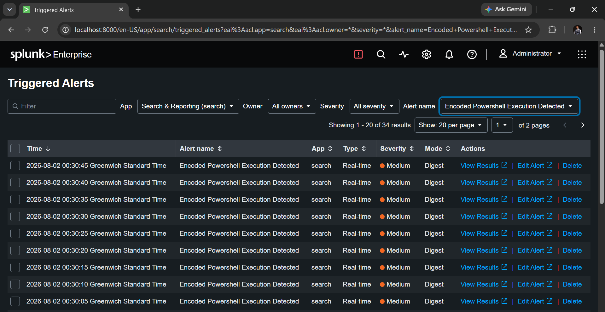
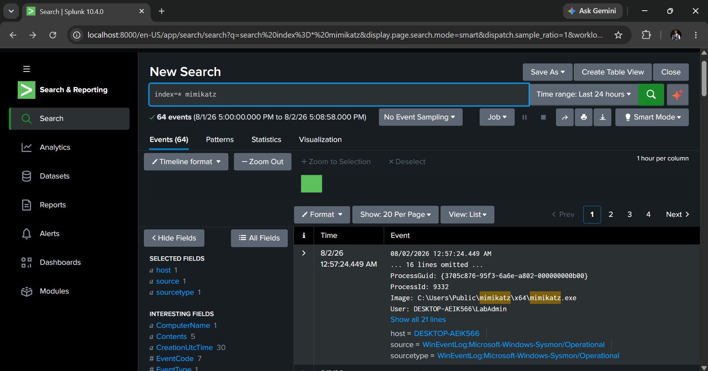

# SOC Analyst Home Lab

A fully functional Security Operations Center (SOC) home lab designed to simulate real-world attack detection, log correlation, and incident response workflows.

---

## Architecture Overview


The lab runs on a host-only network (`192.168.56.0/24`) to ensure telemetry forwarding remains resilient and independent of WAN connectivity.

| Component | Purpose | IP Address |
|-----------|---------|------------|
| **Windows 11 Pro (Host)** | Splunk Enterprise SIEM | `10.143.161.200` |
| **Windows 11 Enterprise (VM)** | Victim endpoint + Universal Forwarder + Sysmon | `10.143.161.201` |
| **Ubuntu Server (VM)** | Linux target | `10.143.161.205` |
| **Kali Linux (VM)** | Attack platform | `10.143.161.204` |

---

## Key Features

- **Resilient Log Forwarding** — Host-only network ensures telemetry persists even when WAN is unavailable
- **Deep Endpoint Telemetry** — Sysmon captures process creation, network connections, file changes, and LSASS access
- **Real-Time Detection** — Automated Splunk alerts trigger on encoded PowerShell execution
- **Attack Simulation** — Mimikatz credential dumping and brute-force attacks are detected and logged in the SIEM

---

## Detection Rules

### Encoded PowerShell Execution
Detects Base64-encoded PowerShell commands — a common malware obfuscation technique.

```spl
index=* source="WinEventLog:Microsoft-Windows-Sysmon/Operational"
EventCode=1 Image="*powershell.exe" CommandLine="*-enc*"
```

---

MITRE ATT&CK: T1059.001 — PowerShell

Mimikatz Credential Dumping
Detects execution of Mimikatz and unauthorized LSASS memory access.

```spl
index=* source="WinEventLog:Microsoft-Windows-Sysmon/Operational"
EventCode=1 Image="*mimikatz*"
```

MITRE ATT&CK: T1003.001 — LSASS Memory

Screenshots
|                                         |                                                        |
| :-------------------------------------- | :----------------------------------------------------- |
| **Splunk Ingesting Endpoint Telemetry** |  |
| **Sysmon Process Creation Telemetry**   |  |
| **Real-Time Alert Triggered**           |              |
| **Mimikatz Detection**                  |          |


Tools Used
| Category               | Tool                                 |
| ---------------------- | ------------------------------------ |
| **SIEM**               | Splunk Enterprise                    |
| **Endpoint Telemetry** | Sysmon (Olaf Hartong modular config) |
| **Log Forwarder**      | Splunk Universal Forwarder           |
| **Attack Simulation**  | PowerShell, Mimikatz, Nmap, Hydra    |
| **Virtualization**     | VirtualBox, UTM                      |


What I Learned

    Designing resilient network architectures with dual-homed VMs
    Configuring and tuning Windows event logging and Sysmon
    Writing Splunk SPL queries and real-time detection alerts
    Mapping detections to the MITRE ATT&CK framework
    Simulating adversary behavior to validate detection coverage


Future Enhancements

    [ ] Add Ubuntu Server to Splunk for multi-OS monitoring
    [ ] Build a Splunk dashboard for attack timeline visualization
    [ ] Write Sigma rules for portable detection engineering
    [ ] Integrate TheHive for case management


Author
Emmanuel Asamoah Kwabena
[LinkedIn] (https://www.linkedin.com/in/emmanuel-asamoah-kwabena-b85830311).

Built: August 2026
