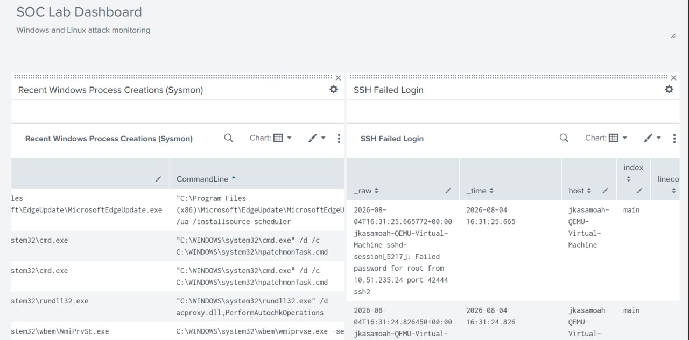
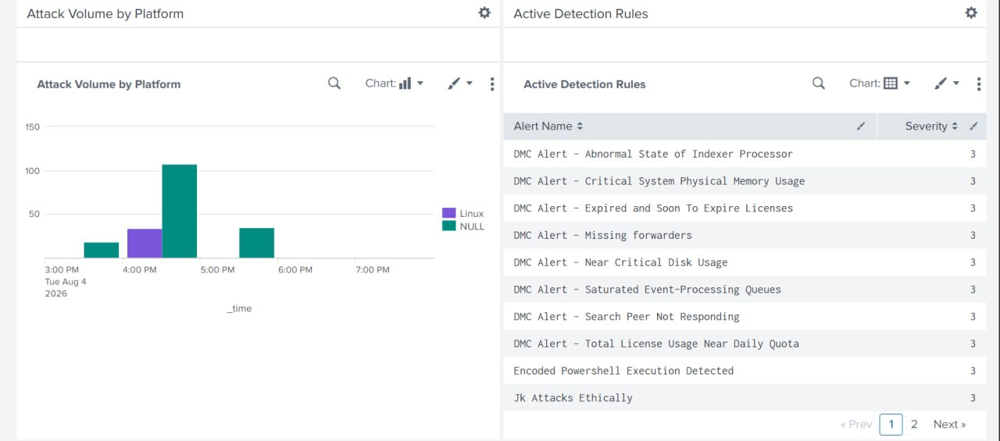
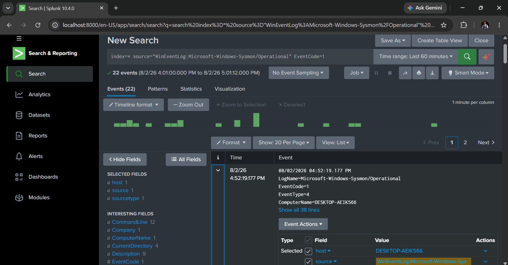
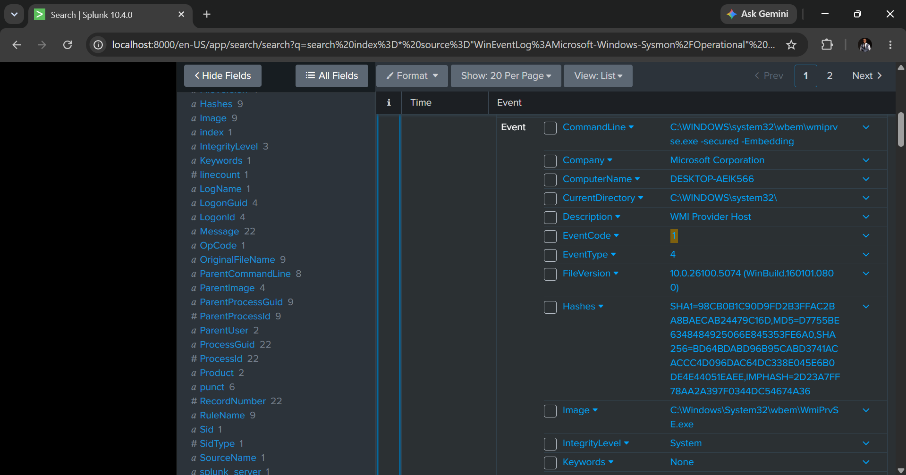
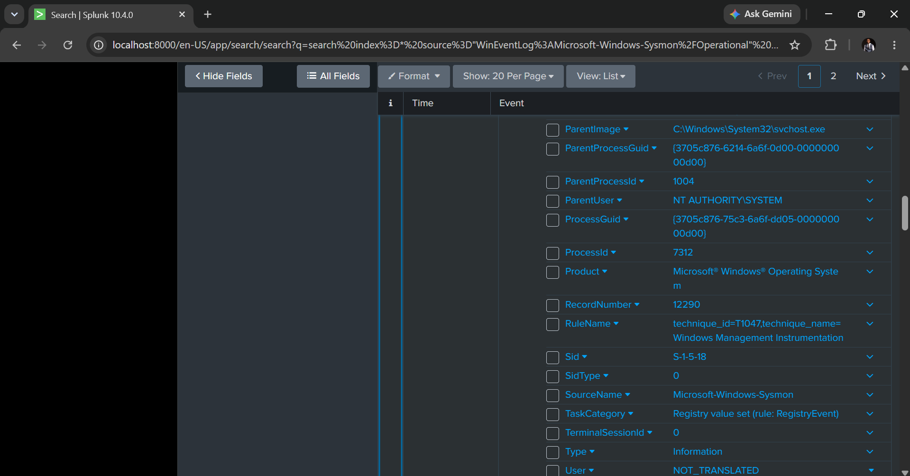

# SOC Analyst Home Lab

A fully functional Security Operations Center (SOC) home lab designed to simulate real-world attack detection, log correlation, and incident response workflows.

---

## Table of Contents

- [Architecture Overview](#architecture-overview)
- [Splunk Dashboard](#splunk-dashboard)
- [Key Features](#key-features)
- [Detection Rules](#detection-rules)
  - [Encoded PowerShell Execution](#encoded-powershell-execution)
  - [Mimikatz Credential Dumping](#mimikatz-credential-dumping)
- [Screenshots](#screenshots)
- [Tools Used](#tools-used)
- [What I Learned](#what-i-learned)
- [Future Enhancements](#future-enhancements)


---


## Architecture Overview


The lab runs on a host-only network (`192.168.56.0/24`) to ensure telemetry forwarding remains resilient and independent of WAN connectivity.


## Splunk Dashboard

Real-time monitoring of Windows and Linux endpoint attacks:





---


| Component | Purpose | IP Address |
|-----------|---------|------------|
| **Windows 11 Pro (Host)** | Splunk Enterprise SIEM | `10.143.161.200` |
| **Windows 11 Enterprise (VM)** | Victim endpoint + Universal Forwarder + Sysmon | `10.143.161.201` |
| **Ubuntu Server (VM)** | Linux target | `10.143.161.205` |
| **Kali Linux (VM)** | Attack platform | `10.143.161.204` |

---

## Key Features

- **Resilient Log Forwarding** — Host-only network ensures telemetry persists even when WAN is unavailable
- **Deep Endpoint Telemetry** — Sysmon captures process creation, network connections, file changes, and LSASS access
- **Real-Time Detection** — Automated Splunk alerts trigger on encoded PowerShell execution
- **Attack Simulation** — Mimikatz credential dumping and brute-force attacks are detected and logged in the SIEM

---

## Detection Rules

### Encoded PowerShell Execution
Detects Base64-encoded PowerShell commands — a common malware obfuscation technique.

```spl
index=* source="WinEventLog:Microsoft-Windows-Sysmon/Operational"
EventCode=1 Image="*powershell.exe" CommandLine="*-enc*"
```
MITRE ATT&CK: T1059.001 — PowerShell

---


### Mimikatz Credential Dumping
Detects execution of Mimikatz and unauthorized LSASS memory access.

```spl
index=* source="WinEventLog:Microsoft-Windows-Sysmon/Operational"
EventCode=1 Image="*mimikatz*"
```
MITRE ATT&CK: T1003.001 — LSASS Memory

---

## Screenshots

### Splunk Ingesting Endpoint Telemetry


### Sysmon Process Creation Telemetry 01


### Sysmon Process Creation Telemetry 02


### Sysmon Process Creation Telemetry 03


### Real-Time Alert Triggered


### Mimikatz Detection


---

## Tools Used

| Category               | Tool                                 |
| ---------------------- | ------------------------------------ |
| **SIEM**               | Splunk Enterprise                    |
| **Endpoint Telemetry** | Sysmon (Olaf Hartong modular config) |
| **Log Forwarder**      | Splunk Universal Forwarder           |
| **Attack Simulation**  | PowerShell, Mimikatz, Nmap, Hydra    |
| **Virtualization**     | VirtualBox, UTM                      |

---

## What I Learned

- Designed a resilient network architecture using VirtualBox Host-Only and NAT networking.
  
- Configured and tuned Windows Event Forwarding (WEF) and Sysmon.
  
- Developed Splunk SPL queries to detect suspicious activity.
  
- Mapped detections to the MITRE ATT&CK framework.
  
- Simulated adversary techniques to validate detection rules.

---

## Future Enhancements

- Add Ubuntu Server logs to Splunk for centralized monitoring.
  
- Build interactive Splunk dashboards for security monitoring.
  
- Write Sigma detection rules for portability across SIEM platforms.
  
- Integrate TheHive for incident response and case management.


---

## Author

**Emmanuel Asamoah Kwabena**

**LinkedIn**
[Emmanuel Asamoah Kwabena](https://www.linkedin.com/in/emmanuel-asamoah-kwabena-b85830311).
